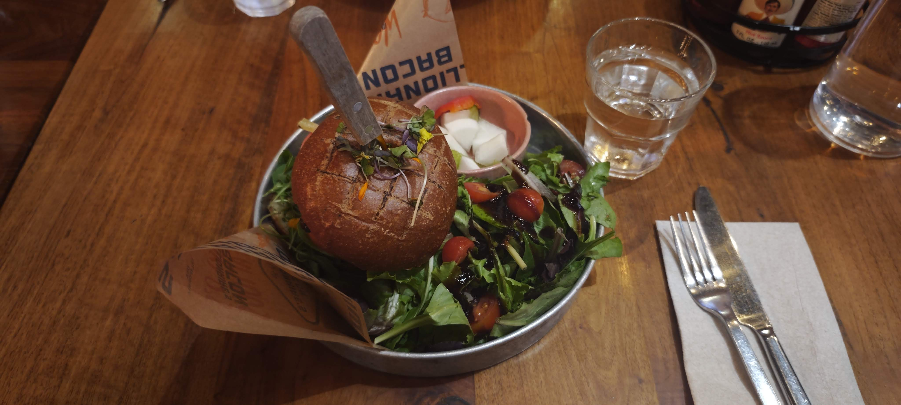
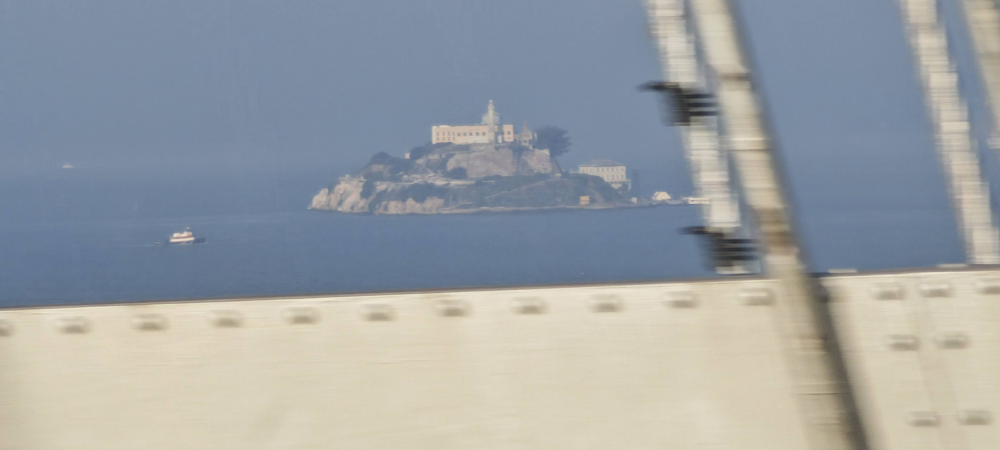
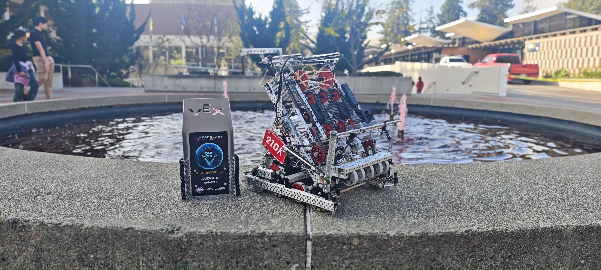
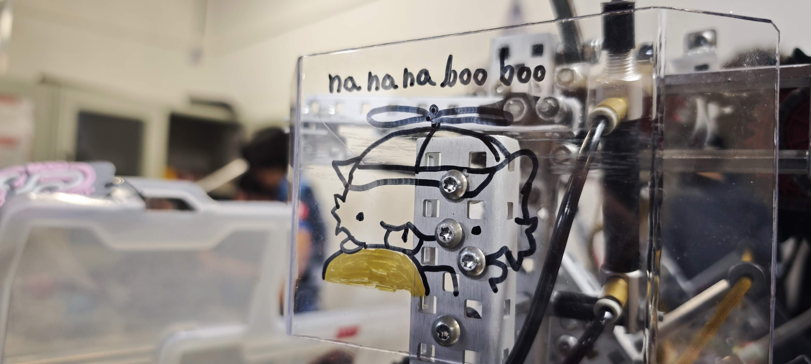

With 2025 having already been over for 28 days, I think now is a perfectly sufficient time to reflect on the past year.
Given the turnover in semester breaks which is only just happening now, I've finally gotten the time to redesign my website
and add a snazzy blog to it.  

As I'm (anxiously) looking forward to receiving university offers, it's been difficult thinking about what to do with the time I have left in secondary school. My goal with this blog is to provide a resource for other fellow students and programmers to learn from my experiences, hopefully inspiring them along the way. I'm currently working on a guide to programming VEX robots, which mainly includes many of the "hidden" tricks I've accummulated that aren't well-documented elsewhere.

Speaking of robotics, one of the highlights of my 2025 was definitely competing in the VEX Robotics Competition Signature Event "One World @ UC Berkeley" with my team. We won our first international award, a huge milestone we've been working to achieve for many seasons. 
Though subtle, I believe this is what creates the distinction between a great team and a world-class team. With the limited time I have left in VRC, a big focus of mine is to teach the next generation of competitors I know, with the hope that our peak becomes their low ;)

Anyway, that's it for the first post to this blog. Have some photos!

  

